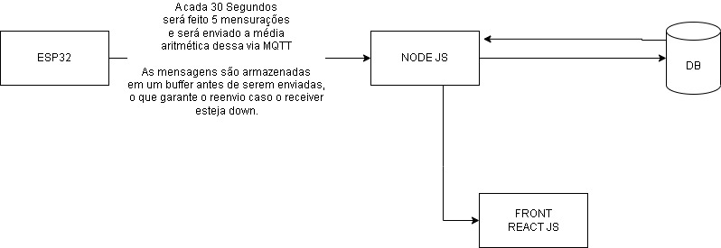

# Projeto de Monitoramento e Comunicação MQTT

Este projeto implementa um sistema de monitoramento que captura dados de um sensor MQ7 e os envia via MQTT para um servidor Node.js. O servidor Node.js recebe os dados e fornece uma interface web para visualização.

## Arquitetura

A arquitetura do projeto é ilustrada no diagrama a seguir:

### Descrição do Diagrama:

- **ESP32**: Este é o microcontrolador que captura os dados dos sensores. Ele utiliza MQTT para enviar os dados dos sensores até o backend.

- **NODE JS**: Este é o servidor Node.js que atua como um broker MQTT, escreve e lê dados do banco e envia a análise dos dados por meio de uma api para o front.

- **DB (Banco de Dados)**: O servidor Node.js salva tudo que recebe do microcontrolador no banco de dados. O ideal para um cenário real seria ter um REDIS entre o ESP32 e o servidor NODE JS, que sincroniza com o banco de dados para garantir que tudo que existe no REDIS existe no Banco de dados, mas dado o tempo de desenvolvimento, optamos por colocar apenas um simples buffer.

- **FRONT REACT JS**: Será o front onde ocorrerá a visualização dos dados capturados.

### Funcionalidades Principais:

- A cada 30 segundos, o ESP32 faz 5 medições e envia a média aritmética desses dados via MQTT.

- As mensagens são armazenadas em um buffer no ESP32 antes de serem enviadas, garantindo o reenvio em caso de falha

- Escalabilidade para mais sensores, sendo apenas necessário criar um novo tópico MQTT.